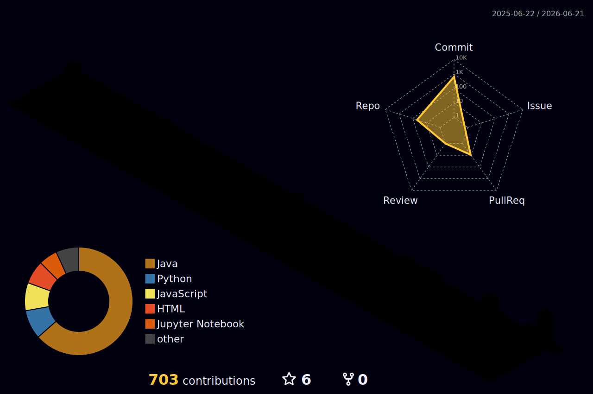

<div align="center">

<!-- ANIMATED HEADER BANNER -->


<!-- TYPING ANIMATION -->
<p align="center">

</p>

<br/>

<!-- GIF -->


<br/><br/>

<!-- SOCIAL BADGES -->
[](https://www.linkedin.com/in/bhageerathareddykuppireddy)
[](mailto:bhageerathareddykuppireddy@gmail.com)
[](https://portfolio-five-pi-wkgf3srveu.vercel.app/)
[](https://github.com/kuppireddybhageerathareddy1110)
[](https://leetcode.com/u/kuppireddy_bhageeratha_reddy)

<br/>

<!-- STATS BADGES -->


<br/>

<i><b>Hey there! I'm a developer & AI enthusiast from 🇮🇳 India, crafting code to solve real-world problems.</b></i><br/>
<i>From ML models to high-performance Java apps, I build with passion and precision.</i>

</div>

---

## 🙋‍♂️ About Me

```python
class BhageератhaReddy:
    def __init__(self):
        self.name       = "Bhageeratha Reddy Kuppireddy"
        self.location   = "India 🇮🇳"
        self.role       = ["AI Engineer", "ML Developer", "Full Stack Dev", "Java HPC Engineer"]
        self.languages  = ["Python", "Java", "JavaScript", "TypeScript", "C++", "R"]
        self.interests  = ["Machine Learning", "Deep Learning", "HPC", "Open Source"]
        self.currently  = "Building ML systems & AI-powered web apps"
        self.open_to    = "AI · Full-Stack · Open-Source Collaborations ⭐"
        self.fun_fact   = "I debug best with lo-fi music playing 🎵"

    def say_hi(self):
        print("Thanks for dropping by! Let's build something amazing together 🚀")

me = BhageератhaReddy()
me.say_hi()
```

---

## ⚡ Quick Stats

<div align="center">

| 🧠 ML Projects | 🏆 Best Accuracy | ⚡ Matrix Scale | 🌐 Frameworks | ☕ Languages |
|:-:|:-:|:-:|:-:|:-:|
| **5+** | **81%+** | **4096 × 4096** | **10+** | **6** |

</div>

---

## 🚀 What I'm Working On

| Area | Description |
|------|-------------|
| 🧠 **ML Systems** | Predictive models for healthcare analytics, sentiment analysis & structured datasets |
| 🔬 **Deep Learning** | LSTM networks for human activity recognition & sensor time-series data |
| ⚡ **Java HPC** | Parallel matrix multiplication & 2D convolution on 4096×4096 matrices |
| 🌐 **AI Web Apps** | Deploying ML models via React + Flask dashboards with live visualizations |
| 📊 **Data Science** | Feature engineering, hyperparameter tuning, reproducible experiments |
| 🤖 **Exploring** | Large Language Models, RAG pipelines & AI agents |

---

## 🎓 Education & Certifications

<div align="center">

| 🎓 Degree | 🏛️ Institution | 📅 Year |
|-----------|---------------|---------|
| B.Tech — Computer Science & Engineering | VIT-AP University | 2022 – 2026 |

</div>

---

## 🌱 Currently Learning

```text
🔭  Large Language Models & RAG pipelines
⚡  Kubernetes & container orchestration
🦀  Rust programming language
📖  Reading: "Designing Machine Learning Systems" — Chip Huyen
🎯  Goal: Meaningful open-source contributions to ML libraries
🌐  Exploring: MLOps, model serving & production AI systems
```

---

## 🛠️ Tech Stack

### 👨‍💻 Languages


### 🤖 AI / ML / DL


### 🌐 Web & Frameworks


### ☁️ DevOps & Cloud


### 🗄️ Databases & OS


### 🎨 All Icons at a Glance

<p align="center">

</p>

---

## 🔍 Featured Projects

### 🧠 Machine Learning

<details>
<summary><b>🫀 Heart Disease Prediction System</b> &nbsp;   </summary>
<br/>

> Ensemble ML model for clinical heart disease classification.

**🔧 Tech:** Python · Scikit-learn · Pandas · NumPy · Matplotlib

- Built ensemble models using **Random Forest and Bagging** classifiers
- Performed **data preprocessing, feature engineering, and hyperparameter tuning**
- Achieved **81%+ accuracy** on heart disease classification
- Evaluated using **confusion matrix, ROC curve, and cross-validation**

[](https://github.com/kuppireddybhageerathareddy1110/heart-disease-ml)
</details>

<details>
<summary><b>🍷 Wine Quality Prediction</b> &nbsp;  </summary>
<br/>

> Regression-based wine quality scoring with advanced regularization techniques.

**🔧 Tech:** Python · Scikit-learn · Pandas · Matplotlib

- Built regression models including **Ridge, Lasso, and Principal Component Regression**
- Implemented a **complete ML pipeline** with preprocessing and model evaluation
- Visualized model performance and feature relationships

[](https://github.com/kuppireddybhageerathareddy1110/wine-quality)
</details>

<details>
<summary><b>💬 Sentiment Analysis Engine</b> &nbsp;  </summary>
<br/>

> NLP pipeline for multi-class sentiment classification on real-world text data.

**🔧 Tech:** Python · NLTK · Scikit-learn · Pandas · Seaborn

- Built a text classification pipeline with **TF-IDF vectorization**
- Applied **Logistic Regression, Naive Bayes, and SVM** for sentiment scoring
- Handled class imbalance and visualized confusion matrices and word clouds

[](https://github.com/kuppireddybhageerathareddy1110)
</details>

---

### 🤖 Deep Learning

<details>
<summary><b>🏃 Human Activity Recognition</b> &nbsp;  </summary>
<br/>

> Sequence-based deep learning for real-time activity classification from sensor data.

**🔧 Tech:** Python · TensorFlow / PyTorch · LSTM · NumPy

- Developed a **deep learning model using LSTM architecture**
- Classified human activities from **sensor time-series data**
- Implemented sequence modeling and full neural network training pipeline

[](https://github.com/kuppireddybhageerathareddy1110/activity-recognition)
</details>

---

### 🌐 AI Web Apps

<details>
<summary><b>📊 ML Model Dashboard</b> &nbsp;  </summary>
<br/>

> Full-stack web app that deploys ML models with real-time predictions and interactive charts.

**🔧 Tech:** React · Flask · Python · Chart.js · Tailwind CSS

- Built a **REST API with Flask** to serve trained ML models
- Developed a **React dashboard** with live prediction visualizations
- Integrated **file upload, real-time inference, and result display**

[](https://github.com/kuppireddybhageerathareddy1110)
</details>

---

### ⚡ High-Performance Computing

<details>
<summary><b>📦 Parallel Matrix Operations</b> &nbsp;  </summary>
<br/>

> Highly optimized concurrent matrix operations for large-scale computation.

**🔧 Tech:** Java · Multithreading · High-Performance Computing

- Implemented **parallel matrix multiplication and 2D convolution**
- Optimized computation on **4096×4096 matrices** using Java multithreading
- Focused on **performance optimization and concurrent processing**

[](https://github.com/kuppireddybhageerathareddy1110/matrix-java)
</details>

---

## 🏆 Achievements & Milestones

<div align="center">

| 🥇 | 💯 | 🧠 | ⚡ | 🌍 | 🔬 |
|:-:|:-:|:-:|:-:|:-:|:-:|
| First PR Merged | Consistent Coder | ML Systems Builder | HPC Champion | Open Source Contributor | Deep Learning Explorer |

</div>

---

## 📈 LeetCode Progress

<div align="center">

[](https://leetcode.com/u/kuppireddy_bhageeratha_reddy)

</div>

---

## 📊 GitHub Stats

<div align="center">


</div>

<br>


<p align="center">
  <strong>GitHub Stats</strong>
</p>

<p align="center">
  
  
</p>
---

## 📈 Contribution Activity

<div align="center">


</div>

---

## 🐍 Contribution Snake

<p align="center">

</p>

---

## 📊 3D Contributions



---

## ⚡ Fun Facts & Personality

```text
🎵  I debug best with lo-fi music playing
♟️  Chess player — apply strategy to code too
🌌  Fascinated by astronomy & the cosmos
☕  Coffee + Python = infinite productivity
📚  Currently reading: "Deep Learning" — Goodfellow, Bengio & Courville
🔁  Motto: Build · Break · Learn · Repeat
```

---

## 📫 Connect With Me

<div align="center">

[](https://www.linkedin.com/in/bhageerathareddykuppireddy/)
[](mailto:bhageerathareddykuppireddy@gmail.com)
[](https://portfolio-five-pi-wkgf3srveu.vercel.app/)
[](https://leetcode.com/u/kuppireddy_bhageeratha_reddy)

</div>

---

<div align="center">


<br/><br/>

*"Code is like humor: when you have to explain it, it's bad." — Cory House*

<br/>


<br/><br/>

⭐ **Star my repos if you enjoy my work!** &nbsp;|&nbsp; Always open to **AI · Full-Stack · Open-Source Collaborations**

<br/>

<!-- FOOTER WAVE -->


</div>
